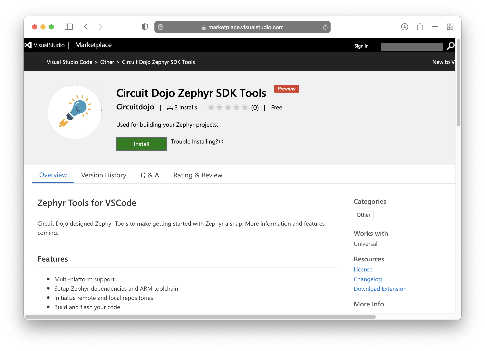
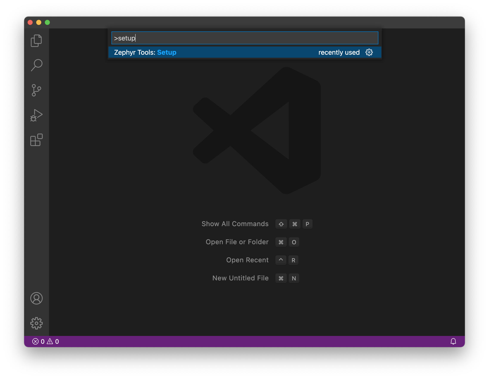
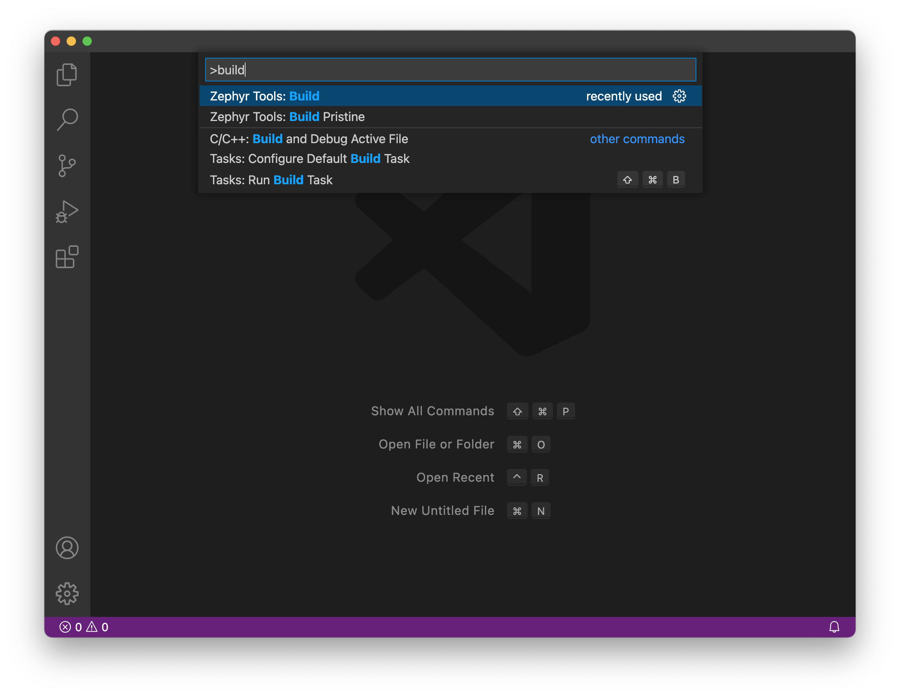
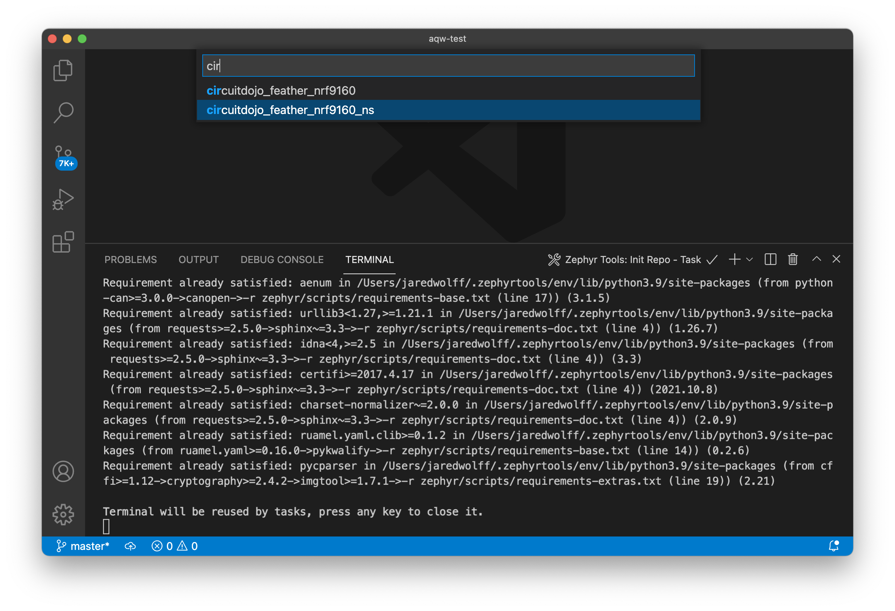
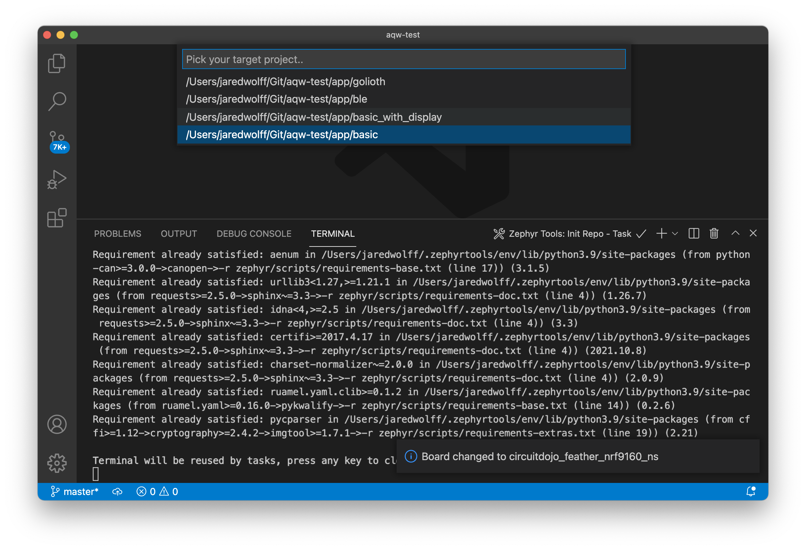
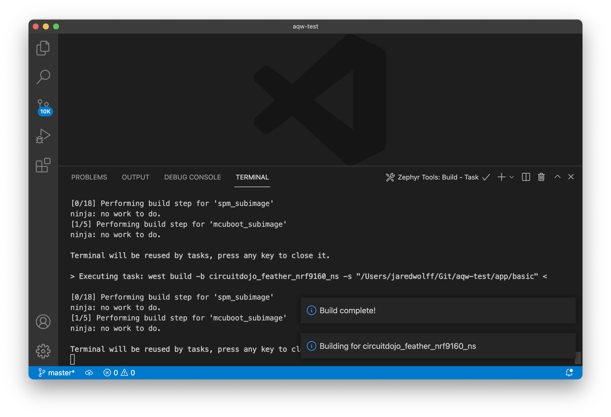
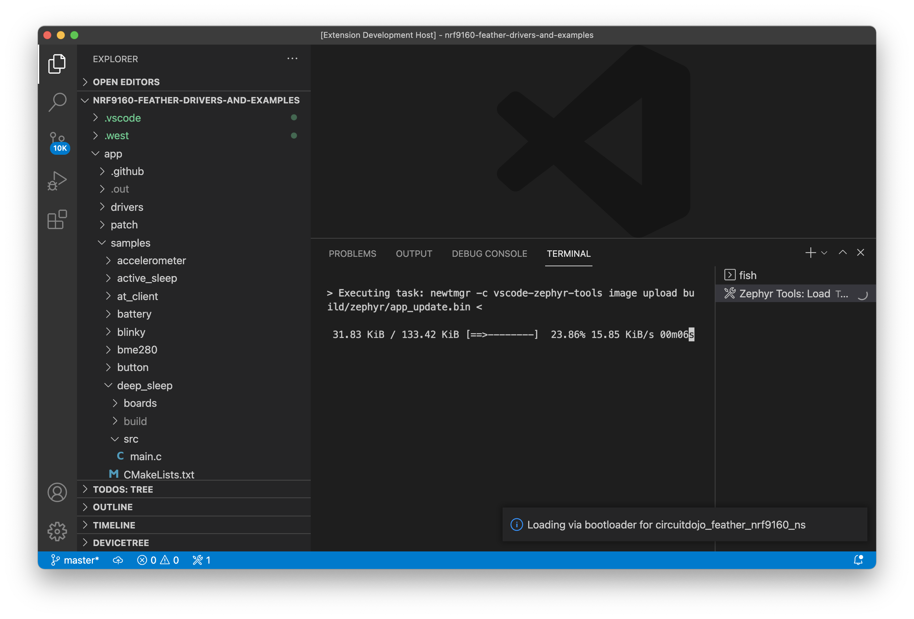

# Air Quality Wing Examples

This repository is contains examples of using the Air Quality Wing with Zephyr.

## Documentation

The documentation for this board and these samples is [located here.](https://docs.jaredwolff.com/air-quality-wing/zephyr-examples.html)

## Setup

**Prebuilt binaries are also [located here.](https://github.com/circuitdojo/air-quality-wing-zephyr-demo/suites/4487788218/artifacts/119565482)** Not all binaries will work out of the box. Golioth binaries require you to edit `golioth.conf` before using. ([See below.](#golioth-configuration))

## Sample descriptions
The code is a a work in progress but includes a BLE example, nRF9160 Feather example an standalone sample. 

### Basic
The **Basic** example connects to and obtain samples on a regular basis. They're printed out to the console. 

### BLE (Bluetooth Low Energy)
The **BLE** example does the same as the **Basic** but also connectable via Bluetooth. Once connected characteristics can be subscribed to and updated by the device. 

### Golioth
The **Golioth** example is the same as **Basic** but it also publishes to the Golioth IoT backend for integration with tools like Grafana.

## Setting up your environment
Here is the minimal amount of steps to get an example working. This example is currently only configured for the nRF52 DK. 

### Hardware

If you do not have a PM2.5 sensor you can comment out `&hpma_sensor,` within `sensors[]` in `main.c` before building. 

### SDK Setup

If you didn't already, install Visual Studio code. You can [download it here.](https://code.visualstudio.com/Download)



Once Visual Studio code is installed, [download the extension here. 👈](https://marketplace.visualstudio.com/items?itemName=circuitdojo.zephyr-tools&ssr=false#overview)

Once loaded it will also install all necessary VSCode dependencies.

Then install Git and Python.

#### Mac

Requires `git` and `python3` to be installed. The easiest way to do that is with [Homebrew](https://brew.sh).

```
> brew install git python3
```

#### Windows

Requires `git` and `python` to be installed.

- Download and install `git` [from here.](https://git-scm.com/download/win)
- Download and install `python` [from here.](https://www.python.org/ftp/python/3.9.9/python-3.9.9-amd64.exe)

#### Linux

Requires `git`,`python` and `pip` to be installed.

Use your distro's package manager of choice to install. 

For example on Ubuntu:

```
sudo apt install git python3 python3-pip
```

### Run Setup

Then open the command window (COMMAND+SHIFT+P on Mac or CTRL+SHIFT+P on other systems) and type `Zephyr Tools: Setup`



### Init the repo

Then initialize this repo using the `Zephyr Tools: Init Repo` command:


Make sure you use `https://github.com/circuitdojo/air-quality-wing-zephyr-demo.git` as the URL. It's best to select an **empty folder** to initialize the project to.

### Switching between manifests 

For the nRF91 related samples you'll need to run:

```
west config manifest.file west-ncs.yml
west update
```

For all others, you'll need to run:

```
west config manifest.file west-vanilla.yml
west update
```

### Then build the sample!



You'll be prompted for a **project** and **board**. Make sure the board matches the supported boards. Current supported board targets include:

- `particle_xenon`
- `circuitdojo_feather_nrf9160_ns`
- `nrf52840dk_nrf52840`

Here's what it will look like:




Once the build completes you should get a **Build complete!** popup along with some success messages in the the terminal.



### Golioth Configuration

You will need to edit `golioth.conf` with your credentials in order to connect to Golioth's backend. More instructions on setting up your credentials can be [found here.](https://docs.golioth.io/docs/guides/golioth-platform-getting-started/platform-manage-devices) You can also create devices and add credentials within the [Golioth Console.](https://console.golioth.io)

## Building and loading using VSCode

Using the command window run **Zephyr Tools: Build**


Then place the device into bootloader mode:
   1. Hold the MODE button
   2. Then tap the RST button while holding mode
   3. **Hold the MODE button until the Blue LED illuminates**


Then, load using the **Zephyr Tools: Load via Bootloader** task.


Pay attention to the progress in the bottom console.



Once complete, the extension will reset your device and should start executing!

**Important:** make sure you close all console sessions with your nRF9160 Feather before programming using `newtmgr`. Otherwise the `newtmgr` image upload will timeout.

## Building Manually

These commands are simlar to what the Zephyr Tools extensions uses. The programming commands are also included here.

### nRF52840 DK

```
cd demo
west build -b nrf52840dk_nrf52840
```

Then flash using

```
nrfjprog --program build/merged.hex --chiperase --reset
```

or load via the bootloader

```
newtmgr -c serial image upload build/zephyr/app_update.bin && newtmgr -c serial reset
```

### Xenon

```
cd basic
west build -b particle_xenon
```

Then flash using

```
nrfjprog --program build/merged.hex --chiperase --reset
```

### nRF9160 Feather

```
cd basic
west build -b circuitdojo_feather_nrf9160_ns
```

Then flash using

```
nrfjprog --program build/merged.hex --chiperase --reset
```

You can also load using `newtmgr`. More information [is here.](../nrf9160-programming-and-debugging.md#using-newtmgr)