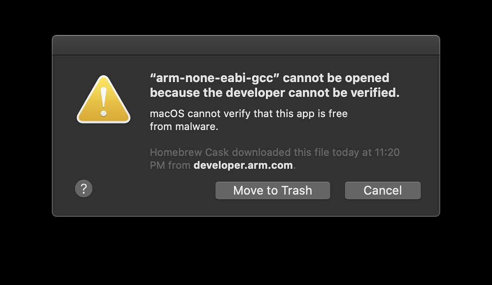

# Air Quality Wing Examples

This repository is contains examples of using the Air Quality Wing with Zephyr.

## Setup

Here is the minimal amount of steps to get an example working. This example is currently only configured for the nRF52 DK. 

### Virtual Environment

Set up a python virual environment:

```
virtualenv -p python3 env
```

Then enable it by running:

```
source env/bin/activate
```

### Install `west`

```
pip3 install west
```

### Init and update project

```
west init -m https://github.com/circuitdojo/air-quality-wing-zephyr-demo.git  --manifest-rev main
```

Or already cloned locally:

```
west init -l .
```

Then run

```
west update
```

### Install remaining python dependencies

```
pip3 install -r zephyr/scripts/requirements.txt
```

### Install toolchain

   * For **Mac** run the following: (it does require you install `wget`. `brew` is an easy way to do so: `brew install wget`)

     ```
     cd ~
     wget "https://developer.arm.com/-/media/Files/downloads/gnu-rm/9-2019q4/gcc-arm-none-eabi-9-2019-q4-major-mac.tar.bz2"
     tar xvfj gcc-arm-none-eabi-9-2019-q4-major-mac.tar.bz2
     rm gcc-arm-none-eabi-9-2019-q4-major-mac.tar.bz2
     ```

     **Note** for Catalina users you will get an error when running these utilities for the first time. You must allow them to be executed in your Security preferences.

     


   * For **Windows** you can download and install the toolchain with [this direct link.](https://developer.arm.com/tools-and-software/open-source-software/developer-tools/gnu-toolchain/gnu-rm/downloads/9-2019-q4-major)

## Building

### nRF52840 DK

```
cd demo
west build -b nrf52840dk_nrf52840
```

Then flash using

```
nrfjprog --program build/merged.hex --chiperase --reset
```

or load via the bootloader

```
newtmgr -c serial image upload build/zephyr/app_update.bin && newtmgr -c serial reset
```

### Xenon

TBD

### nRF9160 Feather

TBD
